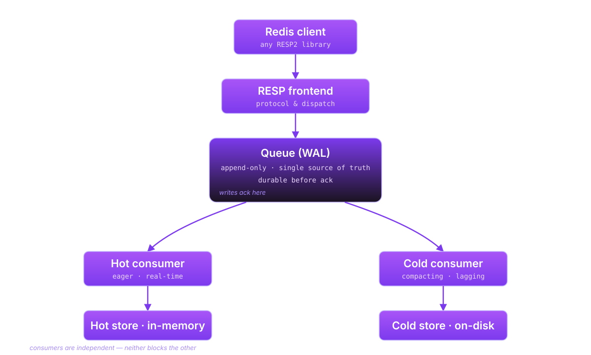

<p align="center">
  <picture>
    <source media="(prefers-color-scheme: dark)" srcset="assets/logo/logo-dark.svg">
    <source media="(prefers-color-scheme: light)" srcset="assets/logo/logo-light.svg">
    
  </picture>
</p>

<p align="center">
  <em>A Redis-compatible KV store with transparent hot–cold tiering.</em>
</p>

<p align="center">
  
  
  
  
</p>

---

## What is Abyss?

A Redis-compatible KV store built on a Kappa architecture: an append-only
queue is the single source of truth, and two independent consumers
materialise that queue into a fast in-memory hot tier and a durable on-disk
cold tier. Writes are not acknowledged until they are durable in the queue,
so a crash never costs you an acked write. Data moves between tiers
automatically. Any Redis client library connects.

## Quick start

```bash
# One-time: install vcpkg and export VCPKG_ROOT (see docs/development/building.md)

cmake --preset default
cmake --build build/default

# Run tests
ctest --preset default

# Run the server
./build/default/apps/abyss-server/abyss-server
```

Requirements: CMake 3.25+, a C++23 compiler (GCC 13+, Clang 17+, Apple
Clang 17+), and vcpkg with `VCPKG_ROOT` set.

## Architecture

<p align="center">
  
</p>

Five hard invariants drive the design:

1. The queue is the single source of truth — no dual writes.
2. A client never receives OK for a lost write.
3. Hot and cold consumers are independent — neither blocks the other.
4. Recovery is pure queue replay; the cold store is never read during recovery.
5. No silent degradation — backpressure surfaces as metrics and errors.

The authoritative diagram and the full design rationale live in
[`docs/design/architecture.md`](docs/design/architecture.md).

## Features

- **Redis compatible.** RESP2 protocol. Any Redis client works out of the box.
- **Two-tier storage.** In-memory hot tier for sub-millisecond reads, on-disk
  cold tier for durability. Transparent promotion and eviction.
- **Durable writes.** Writes are not acknowledged until committed to the
  append-only queue. A crash never loses an acknowledged write.
- **Smart compaction.** The cold consumer collapses intermediate writes — a
  key updated 1000 times results in a single disk write.
- **Pluggable backends.** Embedded (zero dependencies) or external (Kafka,
  DragonflyDB, KVRocks). Mix and match via deployment profiles.
- **Kubernetes-native.** StatefulSet deployment with PVCs; Redis Cluster
  protocol for horizontal scaling.

## Documentation

| Document | Description |
|----------|-------------|
| [Architecture](docs/design/architecture.md) | System design, component model, deployment profiles |
| [Requirements](docs/design/requirements.md) | Performance targets, durability guarantees, milestones |
| [Design Proposals](docs/design/proposals/) | Detailed designs for each subsystem (ADP-001 through ADP-012) |
| [Deployment](docs/operations/deployment.md) | Kubernetes, Helm, configuration reference |
| [Observability](docs/operations/observability.md) | Metrics, health endpoints, logging |
| [Failure Modes](docs/operations/failure-modes.md) | Backpressure, failure scenarios, recovery |
| [Building](docs/development/building.md) | Build from source, presets, dependencies |
| [Testing](docs/development/testing.md) | Test strategy, running tests |
| [Branding](docs/branding.md) | Visual identity, asset workflow |

## Project status

**Phase 1 (embedded profile, single pod) — in progress.** The queue, RESP
frontend, hot and cold consumers, eviction, recovery, prefix-based eviction,
hash commands, fan-out, and FLUSHDB are implemented. Cluster protocol and
horizontal scaling are tracked under later phases.

See [Requirements — Milestones](docs/design/requirements.md#milestones) for
the full roadmap.

## Contributing

### Building from source

```bash
git clone https://github.com/callumc34/abyss.git
cd abyss
# Ensure VCPKG_ROOT is set — see docs/development/building.md
cmake --preset default
cmake --build build/default
ctest --preset default
```

### Code style

- Google C++ Style Guide
- `.cpp` extension, `#pragma once` header guards
- 100-column limit, enforced via `.clang-format`
- Thread-safety annotations on all mutex-guarded members
- Minimal comments — the code should be readable without them

### Running checks

```bash
# Format
find include src tests -name '*.cpp' -o -name '*.h' | xargs clang-format -i

# Static analysis
cmake --build build/default --target abyss_unit_tests
clang-tidy -p build/default src/**/*.cpp

# Sanitizers
cmake --preset asan && cmake --build build/asan && ctest --test-dir build/asan
cmake --preset tsan && cmake --build build/tsan && ctest --test-dir build/tsan
```

## License

TBD.
